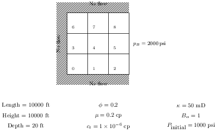

# Homework Assignment 16


## Instructions

The [Simple 2D Problem in CMG](https://youtu.be/Tx1l-dQO5TA) was also the exact problem we wrote our own Python code for in [Assignment 15](https://github.com/PGE323M-Students/assignment15/blob/master/assignment15.ipynb).   Recall the problem schematic



Work through the [tutorial](https://youtu.be/Tx1l-dQO5TA) and import your results into CMG's Resultsapplication.  From there, export the pressures as shown in the tutorial (from the [3 3 3] gridblock).
Save the exported results to a *CSV file* `assignment16.csv`.  Copy this file into this repository, add, commit, and push to Github for submission.

## Testing

If you would like to check to see if your solution is correct, run the following command at the Terminal command line:

```bash
python test.py
```

a status message of `OK` indicates you have the correct solution.
